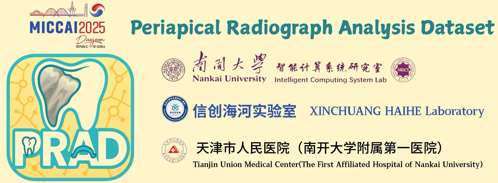
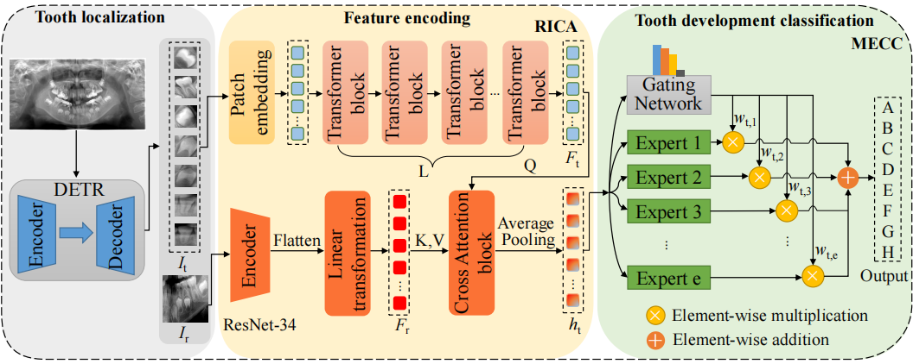
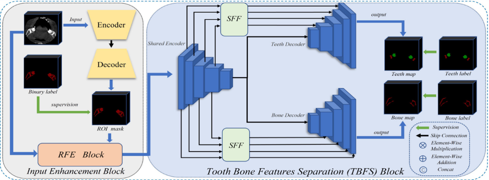
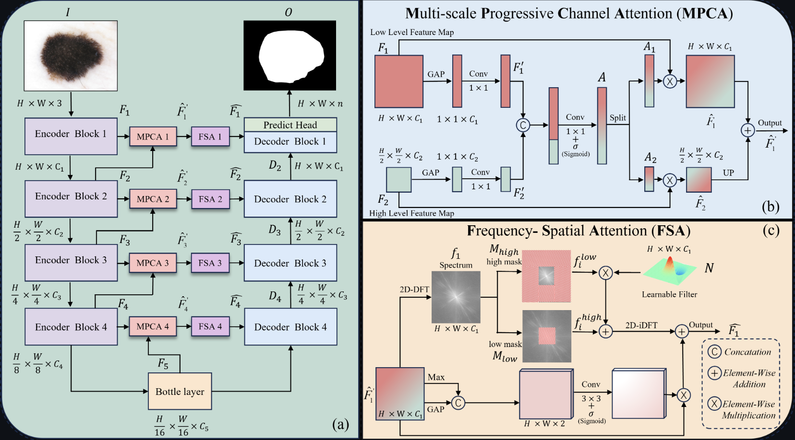

> (†: equal contribution, ✉️: corresponding author, [C]: Conference, [J]: Journal, [A]: Arxiv)

## Publications 📌📌📌:
[//]: # (## Selected Publications)
### 2025 🐍
- **[PRAD: Periapical Radiograph Analysis Dataset and Benchmark Model Development [C]](https://arxiv.org/abs/2504.07760)** 
**Zhenhuan Zhou†**, Yuchen Zhang†, Ruihong Xu, Xuansen Zhao and Tao Li ✉️  
*Medical Image Computing and Computer Assisted Intervention 2025 (MICCAI 2025)* [[Code]](https://github.com/nkicsl/PRAD)

  

- **Towards Automated Pediatric Dental Development Staging: A Dataset and Model [C]** 
Peng Wang, Along He, Zhihong Wang, Anli Wang, **Zhenhuan Zhou** and Tao Li ✉️  
*Medical Image Computing and Computer Assisted Intervention 2025 (MICCAI 2025)* [[Code]](https://github.com/ybupengwang/DDSNet)

  

- **[Cross-Frequency Collaborative Training Network and Dataset for Semi-supervised First Molar Root Canal Segmentation [A]](https://arxiv.org/abs/2504.11856)** 
**Zhenhuan Zhou†**, Yuchen Zhang†, Along He, Peng Wang, Xueshuo Xie and Tao Li ✉️  

- **[Med-URWKV: Pure RWKV With ImageNet Pre-training For Medical Image Segmentation [A]](https://arxiv.org/abs/2506.10858)** 
**Zhenhuan Zhou** and Tao Li ✉️  
---

### 2024 🐲
- **[NKUT: Dataset and Benchmark for Pediatric Mandibular Wisdom Teeth Segmentation [J]](https://ieeexplore.ieee.org/abstract/document/10485282)** 
**Zhenhuan Zhou**, Yuzhu Chen, Along He, Xitao Que, Kai Wang, Rui Yao ✉️ and Tao Li ✉️  
*IEEE Journal of Biomedical and Health Informatics, vol. 28, no. 6, pp. 3523-3533, June 2024* [[Code]](https://github.com/nkicsl/NKUT)

  

- **[Spatial-Frequency Dual Domain Attention Network For Medical Image Segmentation [C]](https://ieeexplore.ieee.org/abstract/document/10822613)** 
**Zhenhuan Zhou**, Along He, Yanlin Wu, Rui Yao, Xueshuo Xie and Tao Li ✉️  
*2024 IEEE International Conference on Bioinformatics and Biomedicine (BIBM 2024)* [[Code]](https://github.com/nkicsl/SF-UNet)

  

---
## Awards 🏆🏆🏆:
- **2024.09:** Nankai University GONGNENG Second Prize Scholarship (￥10,000)
- **2023.10:** "Tiankai Cup" Chuangju Jinmen National College Students Intelligent Technology Innovation and Entrepreneurship Challenge Excellence Award
- **2023.09:** Postgraduate Admission Scholarship (Recommendation & Exam Exemption) (￥3,000)
- **2023.09:** Freshman Scholarship of Nankai University (￥8,000)
- **2022.09:** Outstanding Student Scholarship, Anhui University (￥5,000)
- **2021.09:** “Three Good” Student Award, Anhui University
- **2022.09:** Outstanding Student Scholarship, Anhui University (￥5,000)
- **2020.09:** “Three Good” Student Honorary Title and Outstanding Student Leader Honorary Title, Anhui University 
- **2020.09:** Academic Excellence Scholarship (￥600), Student Leadership and Service Scholarship (￥600) and Social Practice Scholarship (￥600), Anhui University
 
---

## Works 💼💼💼:
- **Reviewer**: IEEE JBHI, ICIBM
- Assistant at NKICS Laboratory; Class President
- Administrative Assistant at the Office of Cybersecurity and Informatization, Party Committee of Nankai University